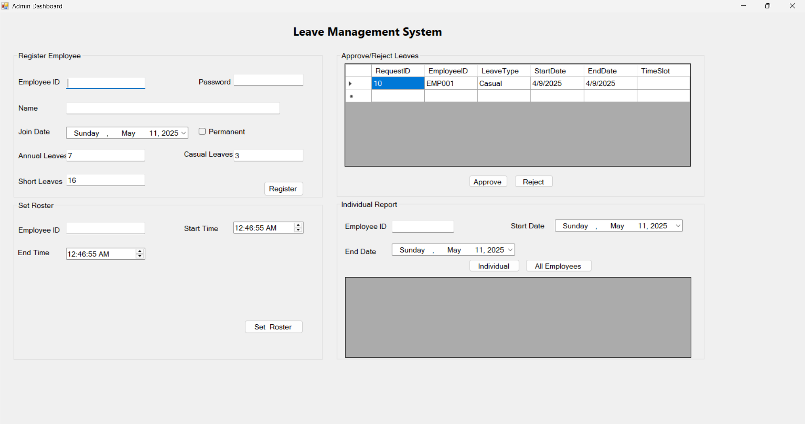

# Leave_Management_System

# Leave Management System

## Overview

This project is a Leave Management System built using `.NET Framework 4.8`. It consists of two main applications:

- **Employee Application**: For employees to manage their leave requests.
- **Admin Application**: For administrators to manage employee leave requests and balances.

## Features

### Employee Application

- Login functionality for employees.
- Submit leave requests.
- View leave history.

### Admin Application

- Login functionality for administrators.
- Approve or reject leave requests.
- Manage employee leave balances.
- Define employee rosters.

## Technologies Used

- **Frontend**: Windows Forms
- **Backend**: C# with ADO.NET
- **Database**: SQL Server (LocalDB)

## Setup Instructions

1. Clone the repository.
2. Open the solution in Visual Studio 2022.
3. Restore NuGet packages if required.
4. Update the connection string in `DataLayer/DatabaseConnection.cs` to point to your SQL Server instance.
5. Build and run the solution.

## Database Schema

The project uses the following database tables:

- **Employees**: Stores employee details.
- **LeaveRequests**: Stores leave request details.
- **LeaveBalances**: Tracks leave balances for employees.
- **Rosters**: Stores employee work schedules.

## Usage

1. Launch the Employee or Admin application.
2. Login using the appropriate credentials.
3. Perform the desired operations (e.g., submit leave requests, approve requests, etc.).

